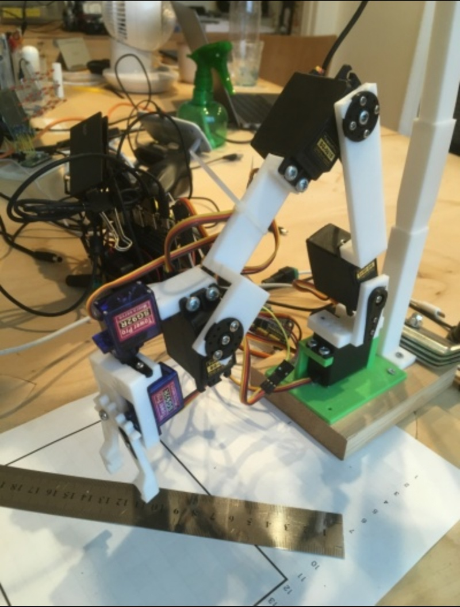

# プロフィール

|      項目名      |       内容       |
| :--------------: | :--------------: |
|      居住地      | 神奈川県相模原市 |
| 稼働可能日数(週) |      週2日       |
|       性別       |       男性       |
|     生年月日     |    1981年5月     |
|       年齢       |       40歳       |
|      配偶者      |        有        |

## 学歴・職歴

| 年月                  | 学歴・職歴                                            | 備考                                                      |
| --------------------- | ----------------------------------------------------- | --------------------------------------------------------- |
| 1999年4月〜2004年3月  | 筑波大学　人間学類                                    | 発達障害について学ぶ                                      |
| 2004年4月〜2008年3月  | 日本オーチスエレベータ                                | 営業職、マーケティング職                                  |
| 2008月4月〜2009年12月 | 養鶏場                                                | 鶏の育成、飼料の製造、等                                  |
| 2010年7月〜2014年3月  | 中央林間幼稚園                                        | 保育補助等                                                |
| 2011年4月〜2015年3月  | 横浜国立大学大学院　教育研究科　特別支援教育学        | 親の子育てと子供の精神疾患の関連についての統計分析(R言語) |
| 2014年7月〜2015年6月  | Gifted Agent 合同会社                                 | 発達障害のある生徒への家庭教師サービス等                  |
| 2015年7月〜現在       | [科学技術教室(個人事業)](https://kagaku-gijutsu.com/) | 小〜高校生に、プログラミング等を教える                    |

## 現在の仕事内容

私は現在、『好きを学びに、学びを仕事に』をモットーに[科学技術教室](https://kagaku-gijutsu.com/)という個人指導塾を個人事業(私一人)として行っています。

生徒の年代、生徒の特性・好みが多岐にわたるため、生徒や保護者とコミュニケーションを取りながら、生徒に合った授業を提供します。様々なニーズに対応していった結果、内容も多岐にわたっています。

### 教室での活動内容

#### 技術関連

1. プログラミング：小学生向けScratch、中高生向けPython
2. 3Dモデリング&プリント : 小学生4年生以上を対象にGoogleのSketchupでモデリングし、Anycubic Kossel Plusにてプリント
3. LEGO Mindstorm : プログラミングして動かせるものを作る
4. Raspberrypi & Raspberrypi  Pico : Pythonの学習用素材の一つとして利用
5. 木工 : 電動工具を使って棚やテーブルを作る
6. 高校・大学進学のための受験勉強支援

#### コニュニケーション関連

1. 生徒の好みの分析及び、将来の仕事につなげるための授業内容の検討
2. 発達障害や、学習に何らかの困難がある生徒と保護者のニーズの把握&助言

### 教室運営

授業以外に、集客や教材作成のための研究開発を行っています。

1. 教室のHPの作成(Vue.js)
2. 教室のオンライン予約システムの作成(Laravel)
3. 物体検知AIでレゴブロックを分別するロボットアームの研究開発(Python, Jetson, Darknet, ROS, OPENCV)
4. 子育てタイプ分析ツールのリリース(iOS, Android)
5. その他教材開発

## 言語・フレームワーク別経験年数

現状で利用頻度の高い順

|   言語・フレームワーク等    | 年数  |
| :-------------------------: | :---: |
|           Python            |  4年  |
|            Bash             |  2年  |
|           Opencv            |  2年  |
|           Darknet           | 0.5年 |
| ROS(Robot Operating System) |  1年  |
|            Flask            | 0.5年 |
|         HTML/HTML5          | 1.5年 |
|            CSS3             | 1.5年 |
|         Javascript          |  1年  |
|           Vue.js            | 0.5年 |
|             PHP             |  1年  |
|           Laravel           |  1年  |

## 自己PR

「現在の仕事内容」に書いたとおり、生徒・保護者のニーズを丁寧に汲み取って、それを効果的な教育につなげていくことをやってまいりました。私が培ってきたコミュニケーション能力は、開発の仕事をする際にも仕事を円滑にすすめる際に、大いに役立つものと思っております。

残念ながら私は、これまでに複数人でのプロジェクトに関わったことがありません。ですのでプロジェクトの進め方の基本については、同僚となる方々にご助言いただきながら仕事をすることになると思います。

しかし、教室を経営していくために必要なことのほとんどすべてを独学で学び、発想して取り組んで参りました。他に助けてくれる人はいない状況での開発ですので、場合によっては1週間位スタックした後に問題解決するようなことも何度か経験しています。

これらのことから、粘り強さ、学習意欲の高さ、解決能力の高さといったものを汲み取っていただければ幸いです。

## 開発歴(新しい順)

### 物体検知AIロボットアーム

使用している言語等：Python, ROS, Darknet, Opencv, Bash

レゴのブロックを種類別に分けるロボットアームを開発しています。ハードウェアはJetson Nanoを利用しています。開発にあたって、これまでに次のような課題を解決しています。

#### 1.ブロックの全種類のスクレイピング

レゴブロックは分け方によっては数千種類に及びます。そのため、手持ちのブロックでは種類が限られることから、スクレイピングを行ってレゴブロックの画像を取得しました。

#### 2.学習データを自作

回転・上下するテーブル(レゴで自作&Pythonで動作)に置かれたブロックを定点カメラで撮影して、サイズ、向き、陰影が異なる学習用データを大量に作成し、学習精度を高めました。

#### 3.物体検知AI

最終的にはJetson Nano(Ubuntu)上で、ブロックの識別とロボットアームの駆動を行おうとしています。Jetson Nanoはスペック的に利用できる学習モデルの種類や大きさに限りがあるため、Darknetを利用しています。実際の学習は、自作した学習用のUbuntuマシンにて行います。

現在、定点カメラの画像からブロックの種類と座標を取得し、アームの先端をその座標に移動させるところまでできるようになっています。実際に掴むためには非常に繊細な動きが必要で、これからの課題です。

ロボットアームは自分で設計&プリントしたものです。ROS(Robot Operating System)をつかって、複数のサーボを同期させながら駆動します。

#### 

### 教室HP

使用している言語等：HTML, CSS, Javascript, Vue.js

教室のHPはVue.jsを利用して作成しました。デザイン、画像素材作成、開発、保守まで全て自分でやっています。

https://kagaku-gijutsu.com/

### オンライン予約システム

使用している言語等：HTML, CSS, Javascript, PHP, Laravel

教室から遠方に在住で授業を希望する生徒向けに、オンライン予約システムを作成しました(Laravel)。クレジット決済のためにStripeのAPIを実装しています。こちらも、デザイン、開発、保守を行っています。

https://kagaku-gijutsu.sakura.ne.jp/online/login

### 子育てタイプ分析ツール(iOS, Android)

使用している言語等：HTML, CSS, Javascript, Onsen UI

大学院の修論で統計分析して作成した質問紙をアプリとして利用できるようにしました(現在、Android版のみ)。デザイン、開発を行っています。

https://play.google.com/store/apps/details?id=com.scitech.HAQ